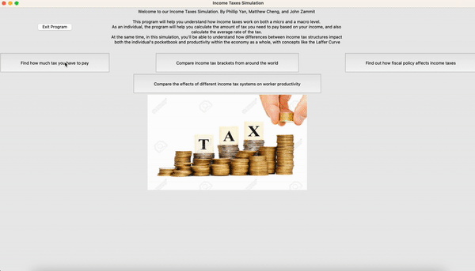

# IncomeTax
This Tkinter GUI uses marginal income tax brackets from around the world to calculate the average tax rate, analyze tax structures and efficiencies, and determine the effect of fiscal policy on income tax.

## Simulation
\

*Brief tour of the GUI*

